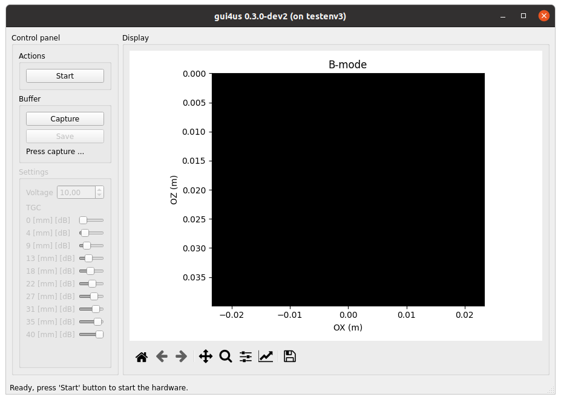
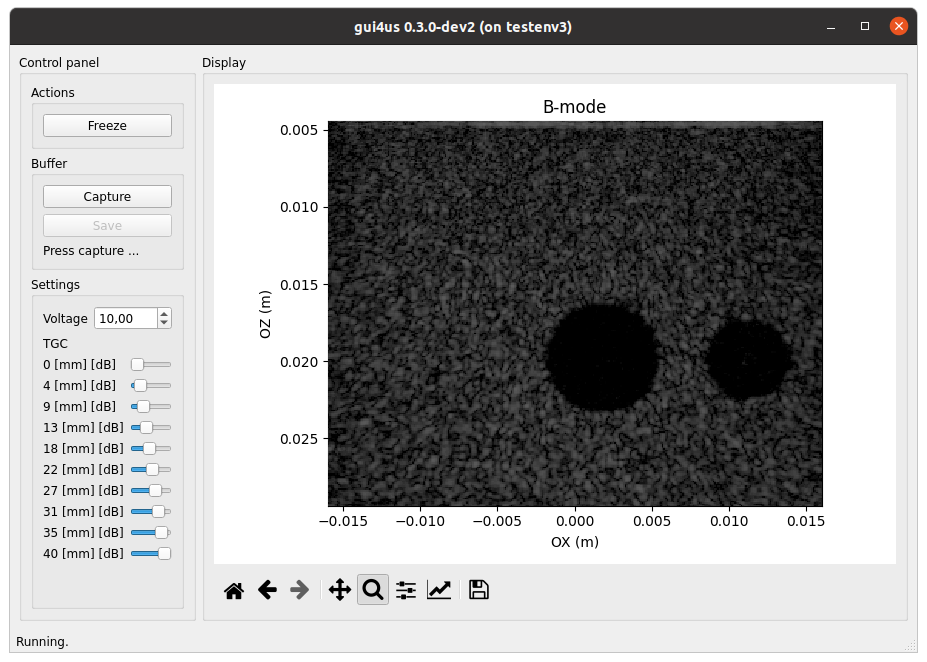

==========
User Guide
==========

Running GUI4us
==============

To run GUI4us, execute the following command in the terminal:

::

    gui4us --cfg /path/to/configuration

Where the ``/path/to/configuration`` is the path to the GUI4us configuration
directory (see the Configuring GUI4us section for more details).

After successfully launching the application, you will see a window like the one
below.

Click ``Start`` to begin the ultrasound system. Click ``Freeze`` to pause the
screen display (note: this does not stop ultrasound transmission!).
Close the window to stop the TX/RX sequence and exit the application.

Configuring GUI4us
==================

The configuration of GUI4US can be defined by preparing a folder with the
following Python scripts:

- ``app.py``: **Application Settings**,
- ``display.py``: **Display Settings**,
- ``env.py``: **Environment Settings**.

In the sections below, we describe the expected content of each of these scripts.

Application Settings
--------------------

Application Settings file ``app.py`` is dedicated for interfacing to the developer
the general application settings.

The file should define the following global variables:

- ``CAPTURE_SIZE_BUFFER``: the size of the data acquistion buffer (number of frame batches to acquire).

Display Settings
----------------

Application Settings file ``display.py`` is dedicated for the display-related
settings.

The file should define the following global variables:

- ``VIEW_CFG``: view configuration file, an instance of the ``gui4us.cfg.display.ViewCfg`` class.

The following hierarchy of the presentation layer objects is adopted:

- A **view** represents the current presentation within a single GUI4us window. It may consist of multiple **displays**.
- A **display** is a single "figure" presented to the user. It has clearly
  defined physical dimensions of the image, axis labels, and the title.
  A display can consist of many **layers**.
  The presentation order of layers is defined by the order of the layer objects in the ViewCfg definition.
- A **layer** represents a single **data source** to be presented with
  specified parameters, such as a given color map and dynamic range.
  The data source is referenced by the ``input`` parameter,
  currently expected to be ``StreamDataId("default", i)``, where ``i`` is the
  output number from the data source. A ``None`` value in the data represents
  a pixel with the alpha channel set to 0.

Example: In the ``color_doppler`` application from the arrus-toolkit project:

- there are two displays: one for Color Doppler and another for Power Doppler,
- the Color Doppler display consists of layers: Color Doppler and B-mode data,
- the Power Doppler display consists of layers: Power Doppler and B-mode data,
- the output numbers are determined by the output numbers from the ARRUS package.

Environment Settings
--------------------

Application Settings file ``env.py`` is dedicated for the environment-related
settings.

The environment represents an object that:

- on one side, provides data for display and acquisition,
- on the other side, allows its parameters to be changed in real time.

An example of such an environment could be the us4us ultrasound system with the
ARRUS software interface: it can provide, for example, B-mode images and raw RF data,
while the parameters that can be controlled include ultrasound imaging parameters such as dynamic range.

Currently, the ``env.py`` file should define the following global variables:

- ``ENV``: environment instance, an instance of ``arrus.model.Env``.

The currently supported environment is the ARRUS ultrasound environment ``gui4us.model.envs.arrus.UltrasoundEnv`` only.
This environment is configured by providing:

- the path to the ``.prototxt`` configuration file,
- a factory function ``configure(session: arrus.Session) ->  ArrusEnvConfiguration``.

The configure factory function should utilize the ARRUS API to define the Scheme
(sequence and processing) and to set necessary parameters for the ultrasound system.
For more details, please check the API Reference.

